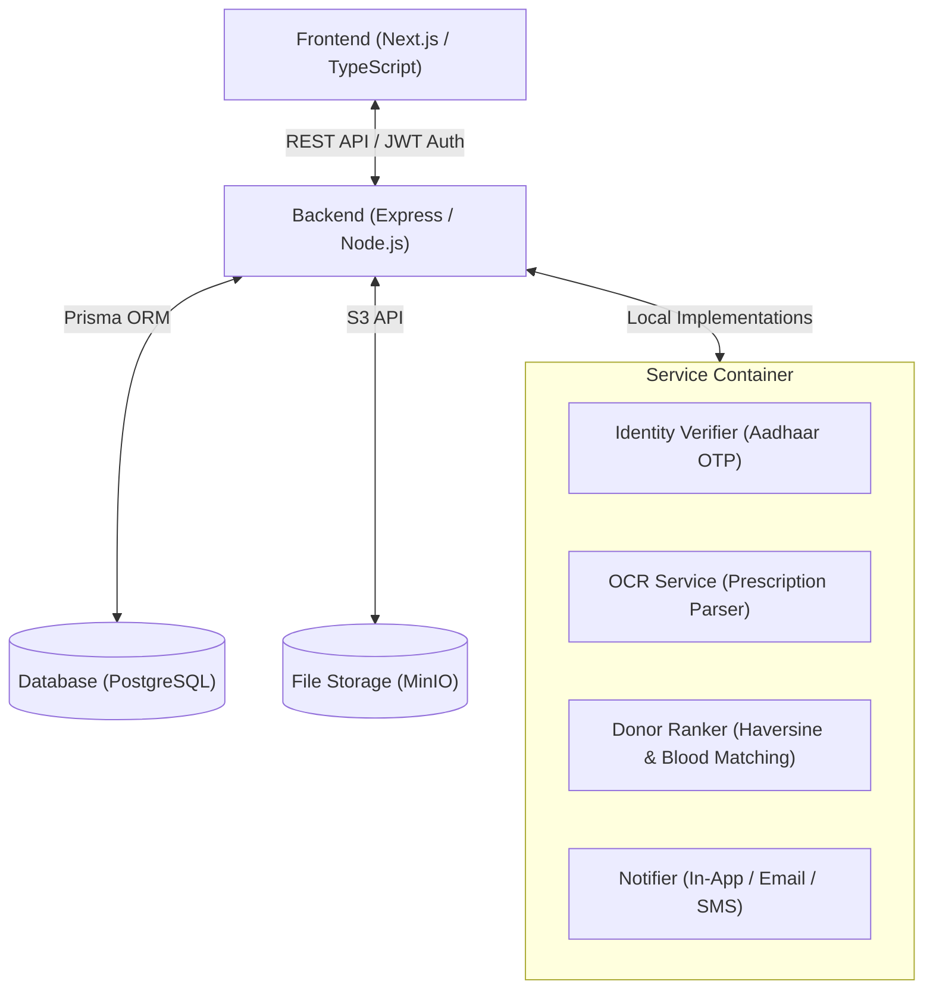
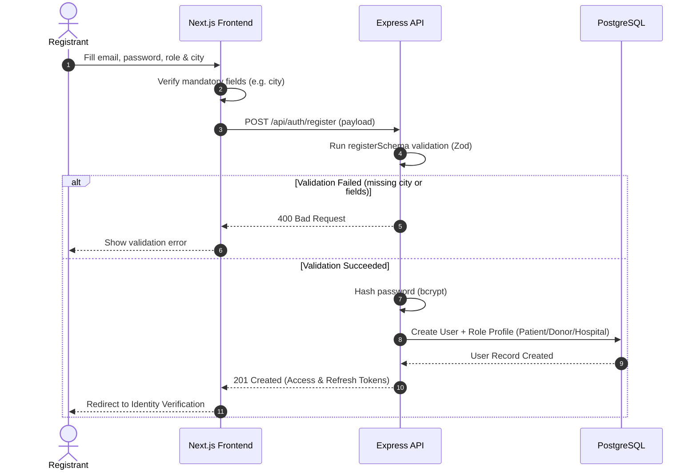
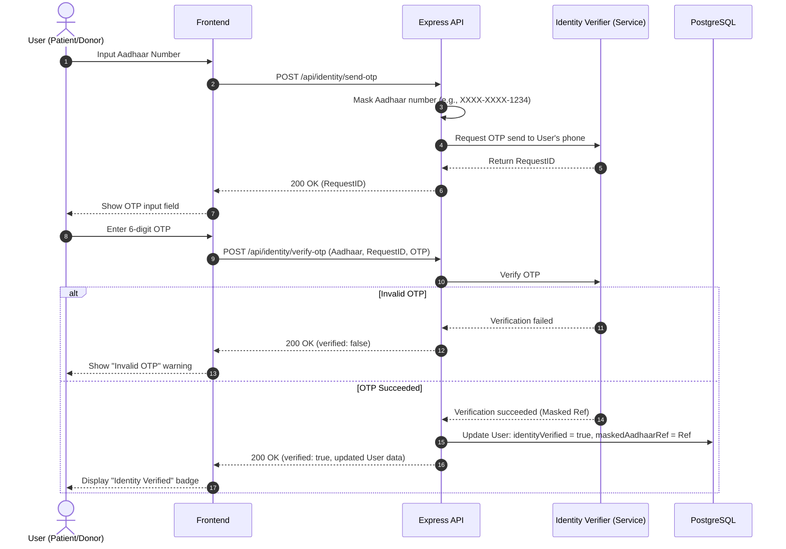
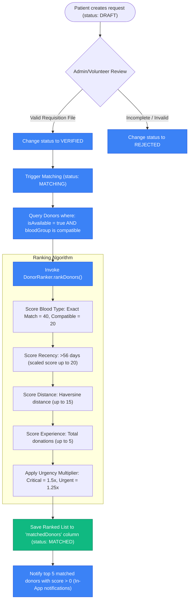
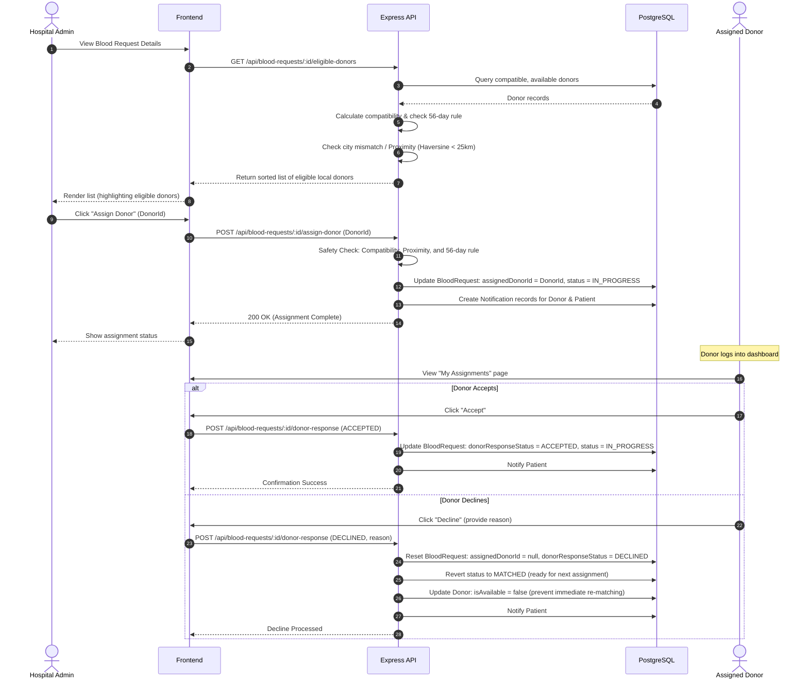
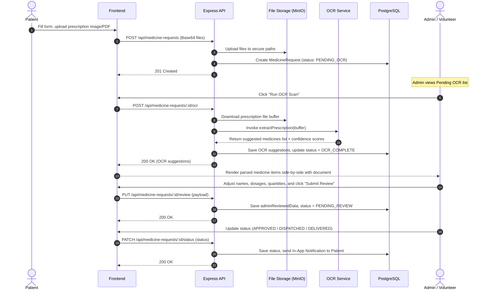

# MentaMind Platform Architecture & Workflows

This repository contains the MentaMind blood donation and medicine request platform. It features safety-critical validation (such as ABO/Rh blood compatibility rules and geographic proximity checking) and automated features like OCR extraction for medical prescriptions.

---

## 1. System Overview & Technology Stack

MentaMind is designed as a modular web application that coordinates blood donations and medicine requests. It features safety-critical validation and automated features like OCR extraction for medical prescriptions.

### Core Technologies
1. **Frontend**: Next.js (App Router, React 18, TypeScript) with vanilla CSS for responsive, glassmorphic dashboards.
2. **Backend**: Express.js REST API with TypeScript, structured with a middleware-first design.
3. **Database & ORM**: PostgreSQL managed via Prisma ORM.
4. **Shared Package**: A custom `@mentamind/shared` TypeScript module containing safety rules (e.g., blood compatibility matrix), status enums, validation utilities, and TypeScript types shared between the client and server.
5. **Storage**: MinIO S3-compatible object storage for prescriptions, income certificates, and blood requisition forms.

---

## 2. Shared Domain Logic & Data Models

### 2.1 The Blood Compatibility Matrix
Located in `packages/shared/src/utils/blood-compatibility.ts`, the platform enforces strict medical rules for red blood cell compatibility:

- **O-** is the universal donor.
- **AB+** is the universal recipient.

The matrix maps each recipient blood group to eligible donor blood groups. The backend exposes two primary utility functions:
- `getCompatibleDonorGroups(recipientGroup)`: returns donors who can give to the recipient.
- `getCompatibleRecipientGroups(donorGroup)`: returns recipients who can receive from the donor.

### 2.2 Database Schema Overview
The database uses standard relations to isolate user roles while maintaining a unified `User` model:
- **`User`**: Base model containing login credentials, role enum (`PATIENT`, `DONOR`, `HOSPITAL`, `VOLUNTEER`, `ADMIN`), and identity verification status.
- **`Patient`**: Extends `User` with age, gender, city, address, and medical history. Has relations to `BloodRequest` and `MedicineRequest`.
- **`Donor`**: Extends `User` with blood group, last donation date, availability flag (`isAvailable`), response score, and geolocation (latitude/longitude) for distance calculations.
- **`Hospital`**: Extends `User` with hospital name, city, department, verified status, and coordinates.
- **`BloodRequest`**: Tracks requisition forms, target blood group, units, hospital address, status (`DRAFT` to `FULFILLED`), matching logs, and assignment of a specific donor.
- **`MedicineRequest`**: Tracks prescriptions, supporting financial documents, OCR suggestions, and verification status.

---

## 3. User Roles & Permission Matrix

The platform implements Role-Based Access Control (RBAC) via the `requireRole` middleware.

| Role | Allowed Dashboards / Sidebar Links | Primary Capabilities |
| :--- | :--- | :--- |
| **PATIENT** | Blood Requests, Medicines, Notifications, Profile | Create blood requests, upload prescriptions, trigger OTP verification, view status. |
| **DONOR** | Blood Pool, My Assignments, Notifications, Donor Profile | Browse compatible blood requests, accept/decline assigned requests, edit availability. |
| **HOSPITAL** | Blood Requests, Notifications, Profile | View patient requests, search and rank eligible local donors, assign a donor. |
| **VOLUNTEER**| Blood Requests, Medicines, Notifications, Assignments, Profile | Verify blood requests, trigger OCR, review medicine lists, log phone interactions. |
| **ADMIN** | Blood Requests, Medicines, Users, Audit Log, Notifications, Profile | System configuration, override requests, view security audit logs, manage users. |

---

## 4. Core Workflows

### 4.1 Registration & Authentication Flow
During registration, users are validated via Zod. The backend requires a `city` for all accounts to support proximity matches.

---

### 4.2 Aadhaar Identity Verification Flow
Before any user can request blood or medicines, they must verify their identity using their 12-digit Aadhaar number.

---

### 4.3 Blood Request & Donor Matching Flow
When a verified Patient creates a request, it goes through review, validation, ranking, and notification.

---

### 4.4 Hospital Assignment & Donor Response Flow
Instead of waiting for random donor response, a Hospital can manually assign an eligible local donor.

---

### 4.5 Medicine Request OCR & Review Flow
Patients can upload a prescription and supporting financial/medical proofs to request free or subsidized medicines.

---

## 5. Security & Auditing

The system records all data-mutating activities for safety and compliance.

### 5.1 Token-Based Authentication
- **Access Tokens**: Short-lived JWTs signed with `ACCESS_TOKEN_SECRET` and stored in headers or cookies. Checked on every secure endpoint.
- **Refresh Tokens**: Long-lived tokens stored in database, used to issue new access tokens via the `/api/auth/refresh` endpoint.

### 5.2 Audit Logging
All changes to blood requests, medicine requests, identity status, and assignments automatically trigger `createAuditLog()` inside router handlers. This creates entries in the `AuditLog` table:
- **`userId`**: Who performed the action.
- **`action`**: e.g., `DONOR_ASSIGNED_BY_HOSPITAL`, `MEDICINE_OCR_COMPLETED`.
- **`entityType` / `entityId`**: The database model and primary key affected.
- **`oldValue` / `newValue`**: JSON snapshots of the changes.
- **`ipAddress` / `userAgent`**: Request headers capturing metadata.

---

## 6. Verification and Diagnostics

### Development and Local Running
For local development, the platform uses Mock/Local implementations of services:
- **OCR**: Returns a stub list of Paracetamol, Amoxicillin, and Cetirizine.
- **Identity Verification**: Generates fake 6-digit OTPs and logs them to the backend console; accepts any 6-digit number to proceed.
- **Notifications**: Writes notifications directly to the PostgreSQL `Notification` table to render in-app notifications and prints them to console.
